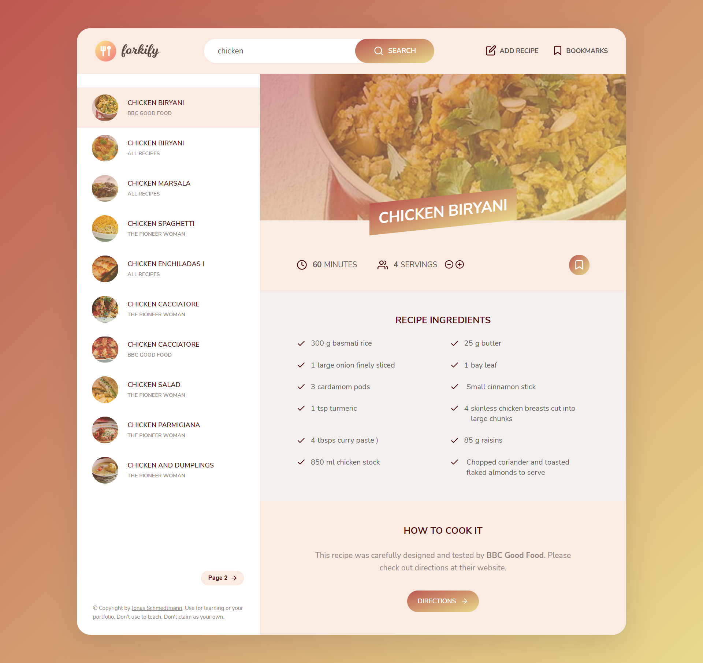

## Forkify Recipe App 🍕

Forkify App is an functional application made with vanilla JavaScript. It interacts with the Forkify API to fetch and display recipes.    
The user can search for a specific recipe, and save to a favorites list via local storage.    
The user can easily increase or decrease servings as per his need and can view detailed directions.

## Usage

1. The Forkify Recipe App allows users to search for recipes.

2. Users can view the recipe along with the cook time and also
   increase or decrease the amount of servings they need.

3. Bookmarked recipes are stored in local storage so no database was
   required for this application.

_For more examples, please refer to the [Documentation](https://forkify-api.herokuapp.com/v2)_

### Built With

This app is built with pure vanilla JavaScript along with HTML and SCSS. It uses webpack as module bundler and NPM as package manager.

- [HTML](https://developer.mozilla.org/en-US/docs/Web/HTML)
- [SCSS](https://sass-lang.com/)
- [JavaScript](https://developer.mozilla.org/en-US/docs/Web/javascript)
- [Webpack](https://webpack.js.org/)
- [NPM](https://www.npmjs.com/)
    
## Demo
[Click Here to see demo](https://nids-forkify-app.netlify.app/)
    
## Acknowledgments

  * The Complete JavaScript Course 2021: From Zero to Expert! by Jonas Schmedtmann
